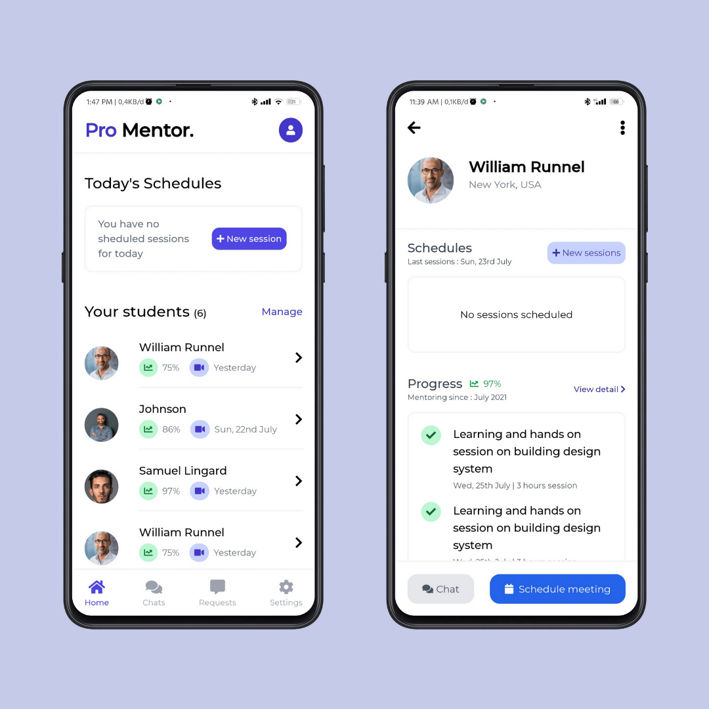

<h3 align="center">Scheduled App</h3>
 

### About
This is my projects to make UI using front end tech 

Where the ideas and the concept i use from any other designer UI/UX from Instagram or Dribbble

### Languages and Tools
- Vue Js 3
- Tailwind
- Vue Router
- Google Font Montserrat
- FontAwesome
- Termux
- Vite Js
- Acode code editor

### Clone This Repo
- <code>git clone https://github.com/bagussatoto/Todo-List.git </code>
- <code>cd Todo</code>
- <code>npm install</code>
- <code>npm run dev</code>

